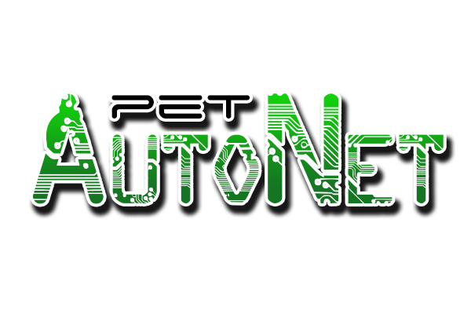

# INTRODUÇÃO A LÓGICA DE PROGRAMAÇÃO EM C - Eventos IFMT
</img>
### O objetivo desse minicurso é proporcionar aos alunos uma base sólida em lógica de programação utilizando a linguagem C, permitindo que possam escrever seus próprios programas. Os exercícios práticos e desafios são fundamentais para fixação dos conceitos e aplicação prática do conhecimento adquirido. Ao final do curso, espera-se que os alunos estejam aptos a escrever programas simples em C e a resolver problemas utilizando programação.

